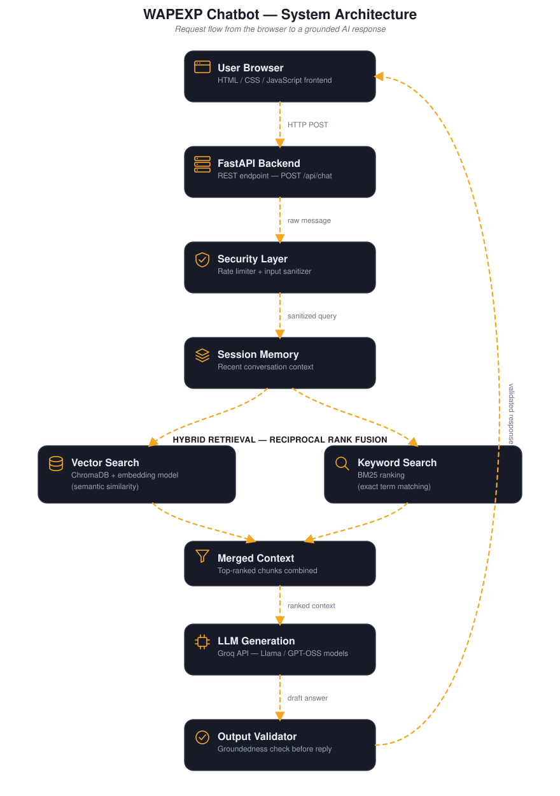

# WAPEXP Chatbot

An AI-powered assistant for WAPEXP Software House that answers questions about courses, fees, timings, and policies using a retrieval-augmented generation (RAG) pipeline grounded in the institute's own data.

  

---

## Overview

Prospective students reach out to WAPEXP with the same set of questions every day — course fees, durations, timings, refund policy, internship guarantees, and more. Answering these manually takes staff time and leads to inconsistent answers between different team members.

The WAPEXP Chatbot solves this by combining a hybrid retrieval system (semantic + keyword search) with a large language model, so every answer is generated directly from the institute's verified course and policy data rather than guessed or hallucinated.

## Problem and Our Solution

| Problem | Our Solution |
|---|---|
| Staff repeatedly answer the same fee/timing/policy questions | A chatbot handles first-line queries instantly, any time of day |
| Generic AI chatbots hallucinate fees, dates, and policies | Retrieval-augmented generation grounds every answer in WAPEXP's actual course and FAQ data |
| Course data spread across PDFs is hard to search | Data is chunked and indexed so both exact keyword and semantic queries return complete, accurate answers |
| Answers can be cut short or drift off-topic | An output validator checks that every response stays grounded in the retrieved context before it reaches the user |

## Key Features and Unique Points

- **Hybrid retrieval** — combines vector similarity search (ChromaDB) with BM25 keyword search, merged through Reciprocal Rank Fusion, so both natural-language and exact-term queries are matched accurately.
- **Grounded answers only** — the system prompt and output validator ensure the assistant never invents fees, dates, or policies; if information isn't in the data, it says so and shares the contact number.
- **Complete answers, not fragments** — a partial question (e.g. asking only about a course's fee) still returns the full matching entry: fee, duration, discount, and curriculum.
- **Session memory** — recent conversation turns are retained per session so follow-up questions stay in context.
- **Built-in protections** — rate limiting and input sanitization guard the API from abuse and prompt-injection attempts.
- **Clean, dedicated frontend** — a lightweight HTML/CSS/JS chat interface, no third-party chat widget dependency.

## System Architecture

  

## Application Screenshot

  

## Conclusion

The WAPEXP Chatbot turns scattered course and policy documents into a fast, reliable, always-available assistant. By grounding every response in verified data and validating outputs before they reach the user, it gives prospective students accurate answers instantly — while freeing up the admissions team to focus on conversations that need a human touch.

  

